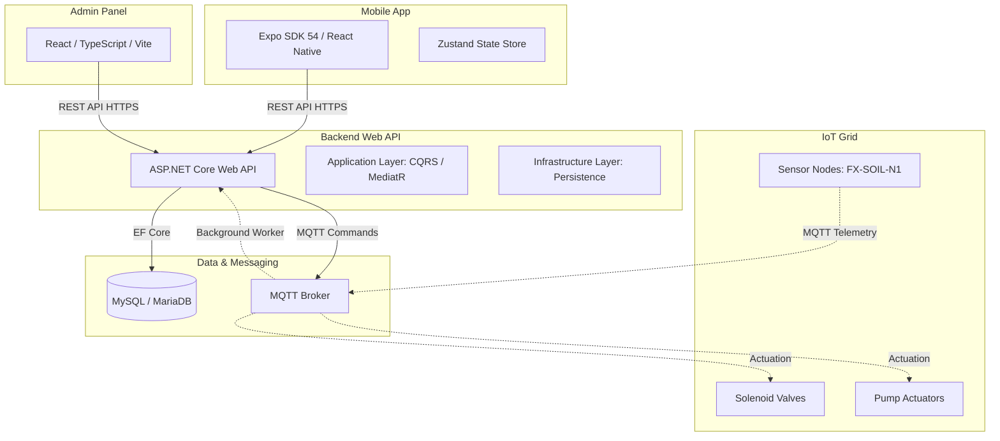

# FLORAX Agropix - Technical Architecture & Overview

FLORAX Agropix is an IoT-powered smart agriculture and precision irrigation management platform designed to automate farm irrigation, monitor soil moisture, trace device health, and optimize water assets.

---

## 🏗️ 1. Technology Architecture

The FLORAX Agropix ecosystem is organized as a unified, modern multi-tier platform built for high availability, security, and real-time telemetry processing.

### Backend (Clean Architecture Core)
Built using **ASP.NET Core (Web API) on .NET 10** following the **Clean Architecture** paradigm to ensure business logic remains isolated and testable.
- **Domain Layer**: Houses core domain entities (`Farm`, `IrrigationZone`, `SensorDevice`, `Motor`, `WaterTank`), value objects, status enums, constants, and custom domain events.
- **Application Layer**: Implements **CQRS** (Command Query Responsibility Segregation) via **MediatR**. Contains pipelines for logging, request validation, custom exception mapping, and transaction boundaries.
- **Infrastructure Layer**: Implements external concerns.
  - **OR/M**: Entity Framework Core targeting MySQL/MariaDB.
  - **Communications**: MQTT client gateway to communicate with IoT nodes.
  - **Identity**: Token-based authentication using custom JWT (Json Web Token) generation.
  - **Background Workers**: Hosted services running constantly in the background to handle MQTT telemetry ingestion and automated irrigation cron schedules.

### Frontend Web (Admin Dashboard)
A responsive desktop portal built using **React, TypeScript, and Vite**.
- **Aesthetics**: Custom dark/light modes using styled vanilla CSS/Tailwind utilities.
- **Features**: Multi-farm telemetry analytics, sensor registration, interactive charts, and system admin configurations.

### Mobile Client (Farmer & Technician App)
A cross-platform mobile shell built using **Expo SDK 54 and React Native**.
- **Routing**: Expo Router (file-based navigation with tab layouts).
- **State Management**: **Zustand** for quick offline-first client storage.
- **Tactile feedback**: Integrated `expo-haptics` to trigger device vibrations when manually starting/stopping water pumps.

---

## 🧠 2. Artificial Intelligence (AI) Integrations

Precision irrigation is driven by combining sensory telemetry with agricultural data models:

1. **Evapotranspiration Modeling**:
   - The platform can utilize crop type data (e.g., Apple, Grape, Alfalfa) and soil profiles (e.g., Clay Loam, Sandy Loam) stored in the database alongside local weather inputs (temperature, humidity, solar exposure) to calculate the real-time Evapotranspiration rate ($ET_c$) using the **Penman-Monteith equation**.
2. **Weather-Aware Intelligent Scheduling**:
   - An AI scheduler integrates external weather forecasts. If high-confidence rain is forecast within the next 6 hours, the system automatically delays or skip scheduled irrigation runs, saving water assets.
3. **Anomaly Detection (IoT Health)**:
   - Evaluates telemetry signals to flag hardware anomalies. For example, if a valve is turned "ON" but soil moisture shows zero change, or if water level readings jump erratically, the system flags the node as `Needs Maintenance` and alerts technicians.

---

## 🔌 3. APIs & Communication Protocols

FLORAX Agropix operates on a hybrid communication model:

### A. REST Web API (HTTPS)
Exposes endpoint controls for user interaction, administration, and reporting.
- **Authentication**: JWT bearer token passed in the `Authorization` header.
- **Core Endpoints**:
  - `POST /api/v1/auth/login`: Validates credentials and returns JWT.
  - `GET /api/v1/dashboard/summary`: Fetches aggregated telemetry summaries.
  - `GET/POST /api/v1/farms`: Lists or creates physical farms.
  - `GET /api/v1/irrigationzones/farm/{farmId}`: Fetches sub-zones.
  - `GET /api/v1/motors`: Live status check of water pump actuators.
  - `GET /api/v1/watertanks`: Fetches water levels and status of reservoirs.

### B. MQTT Protocol (TCP/IP)
A lightweight publish-subscribe protocol ideal for low-bandwidth agricultural wireless links (LoRaWAN/GPRS gateways).
- **Telemetry Ingestion**: IoT sensor nodes publish payload telemetry to topics (e.g., `telemetry/sensors/moisture`) at set intervals.
  - *Payload*: `{"sensorId": "FX-SOIL-N1", "moisture": 42.5, "battery": 88}`
- **Actuator Dispatch**: The backend hosted worker publishes command payloads to actuate pumps/valves (e.g., `commands/motors/1`).
  - *Payload*: `{"command": "START", "durationSeconds": 1800}`

---

## ✨ 4. Innovation & Value Proposition

- **Clean Architecture Monorepo**: Code splits separating business domain from technology framework ensure the codebase can outlive cloud providers or DB migrations.
- **Headless Worker Architecture**: Real-time message consumption and automated triggers run independently of active web/mobile clients.
- **Haptic Tactility**: Tactile verification feedback loop provides assurance to farmers in remote areas that their digital toggle command successfully reached the local actuator switch.
- **Unified Diagnostic Suite**: Gives field technicians a real-time sweep panel logging signal, battery, and firmware parameters directly from their phones.

---

## 🚧 5. Technical Challenges

1. **Dual State Consistency**:
   - Aligning the asynchronous state of MQTT (e.g., command sent, waiting for device acknowledgment) with the synchronous HTTP requests of the mobile client.
2. **Rural Wireless Connectivity (Packet Loss)**:
   - Managing network dropouts. If an IoT node is offline, commands must be safely queued on the MQTT broker using Quality of Service (QoS) Level 1/2.
3. **Power Optimization**:
   - Minimizing power draw on solar/battery IoT nodes on the field. Nodes must remain in "deep sleep" and wake up only to transmit telemetry, rather than listening to open connections continuously.
4. **Cross-Platform Haptics & Secure Store**:
   - Abstracting OS-specific hardware (SecureStore on iOS, KeyStore on Android) to keep credential storage 100% secure.

---

## 🏁 6. Current MVP / Prototype Status

| Component | Status | Done / Operational |
| :--- | :---: | :--- |
| **Database** | **Ready** | MySQL schema initialized (Farms, Zones, Motors, Tanks, Readings tables) |
| **Backend Core** | **Ready** | Clean Architecture solution compile, MediatR pipeline configuration, Web API controllers functional |
| **Frontend Web** | **Prototype** | Initial React template structured with Vite; mock telemetry dashboards |
| **Mobile App** | **Prototype** | Expo routing skeleton, tabs navigation, assets and login structures set up |
| **Git Mono-Repo** | **Consolidated**| All modules (Backend, Frontend, Mobile, docs) merged and tracked in a unified git repository |

---

## 🚀 7. Key Risks & Milestones Ahead

### Milestones
1. **Milestone 1: Integration & End-to-End Simulation** (Next 4 weeks)
   - Connect the background hosted service to a mock MQTT broker (e.g., HiveMQ/Mosquitto) and verify that simulated sensor data successfully updates the database.
2. **Milestone 2: Mobile/Web Authentication Hookup** (Next 6 weeks)
   - Wire the React web client and Expo mobile client to target the live ASP.NET JWT login endpoint rather than simulated states.
3. **Milestone 3: Field Hardware Testing** (Next 12 weeks)
   - Deploy physical sensor node test boards (ESP32/Arduino) in a real greenhouse environment to monitor battery performance and soil reading latency.

### Key Risks
- **Hardware Communication Failures**: Physical solenoid valves failing to open or close due to signal loss or debris. *Mitigation: Auto-alert technicians if telemetry shows no response after command dispatch.*
- **Security Vulnerabilities**: Unauthorized control over water pumps/valves. *Mitigation: Implement strict MQTT ACLs (Access Control Lists) and encrypt command payloads.*
- **Data Ingestion Bottleneck**: Massive database writes as the sensor grid scales to hundreds of farms. *Mitigation: Add Redis cache layer for live telemetry caching and write database logs in batch batches.*
