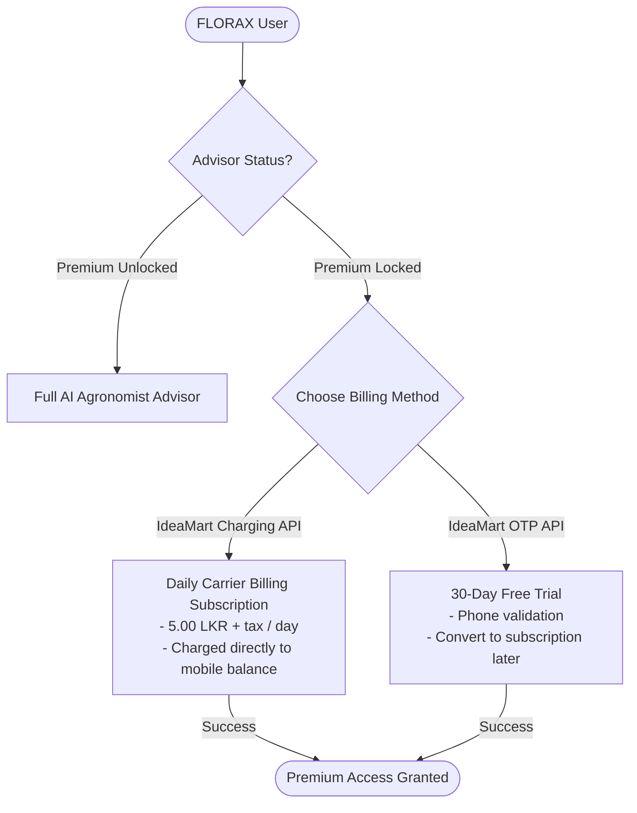

# FLORAX Agropix - Monetisation Plan

This document outlines the business and commercial strategy for **FLORAX Agropix**, specifically connecting the product features to the Dialog IdeaMart API monetization flows demonstrated in the application.

---

## 👥 1. Target Audience & Users

FLORAX Agropix caters to two primary agricultural segments in Sri Lanka and emerging markets:

1. **Commercial Crop Farmers & Agri-Businesses (B2B)**:
   - High-value fruit/vegetable farmers, greenhouse owners, and tea/coconut plantations.
   - *Needs:* Crop health maximization, precise soil moisture management, and cost reduction in pump electrical runtimes.
2. **Smallholder Agrarian Cooperatives (B2C)**:
   - Co-op members managing small to mid-sized vegetable fields.
   - *Needs:* Simple, low-cost diagnostic advice without high upfront consultant fees.

---

## 💳 2. Monetisation Models (Dialog IdeaMart Powered)

We integrate Dialog's frictionless billing and verification APIs to capture value across these user groups without requiring credit card gateways.

### A. Daily Carrier Billing Subscription (IdeaMart Charging API)
- **Rate**: **5.00 LKR + tax / day**
- **Target User**: Smallholders and mid-sized farmers seeking ongoing daily watering optimizations.
- **Mechanics**: Billed directly to the user's Dialog mobile account balance (prepaid debit or postpaid monthly bill) using the **IdeaMart Charging API**.
- **Value Proposition**: 5 LKR daily is highly affordable for smallholders compared to hiring private agronomists. It creates a recurring revenue stream with zero payment friction.

### B. OTP-Verified 30-Day Free Trial (IdeaMart OTP API)
- **Rate**: **FREE for 30 Days** (converts to billing thereafter)
- **Target User**: Unsure users who want to verify value before subscribing.
- **Mechanics**: Users verify their identity and mobile number using a One-Time PIN code sent via the **IdeaMart OTP API**. This registers the device number and grants trial access.
- **Value Proposition**: Lowers entry barrier, builds trust, and allows capturing the user's mobile contact details for trial-to-subscription marketing.

---

## 📈 3. Revenue Mechanics & Unit Economics

Let us estimate the revenue trajectory based on the IdeaMart unit pricing model:

| Parameter | Estimate / Value | Notes |
| :--- | :--- | :--- |
| **Daily Subscription Rate** | 5.00 LKR / user / day | Charged to mobile carrier balance |
| **Gross Monthly Revenue (per user)**| 150.00 LKR | Billed monthly |
| **IdeaMart Revenue Share** | 70% to Developer / 30% to Dialog | Standard carrier billing share |
| **Net Developer Share (per user)** | 105.00 LKR / month | Net revenue after Dialog share |
| **Estimated Cooperative Size** | 2,000 active farmers | Single local cooperative launch |
| **Monthly Net Cooperative Revenue**| **210,000 LKR** | Recurring software service revenue |

### Upsell Opportunities:
1. **Ad-Hoc Specialized Reports**: Charging a one-time fee of **25 LKR** for premium PDF exports of agronomic trends.
2. **Hardware Diagnostics Sweeps**: Charge **10 LKR per sweep** for field technicians using diagnostic tools.
